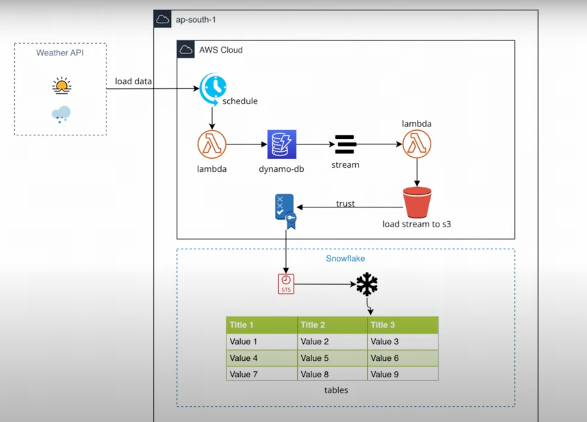

# DE-SnowflakeAWSLambdaDynamoDB



## Overview

This project implements a data engineering pipeline that collects weather data from multiple cities using AWS Lambda functions, stores the data in DynamoDB, and processes DynamoDB streams to export data to S3 for further analysis with Snowflake.

## Architecture Components

### 1. Weather Data Collection Lambda (`snowflakeweatherapiLambda.py`)
- **Purpose**: Collects current weather data from multiple cities using the WeatherAPI
- **Functionality**:
  - Fetches weather data for 10 predefined cities (Houston, Chicago, New York, Seattle, Tampa, Calgary, Phoenix, Atlanta, Washington, San Francisco)
  - Extracts key weather metrics: temperature, feels like temperature, wind chill, wind speed, humidity, and timestamp
  - Stores data in DynamoDB table named "weather"

### 2. DynamoDB Stream Processor Lambda (`DynamoDBStreamS3.py`)
- **Purpose**: Processes DynamoDB streams and exports data to S3
- **Functionality**:
  - Triggers on DynamoDB INSERT events
  - Converts DynamoDB records to pandas DataFrames
  - Exports data as CSV files to S3 bucket "itvorx" in the "snowflake/" prefix
  - Files are named with table name and timestamp for easy identification

## Prerequisites

- AWS Account with appropriate permissions
- Python 3.8 or higher
- AWS CLI configured
- WeatherAPI key (currently hardcoded in the Lambda function)

## Installation

1. Clone the repository:
```bash
git clone <repository-url>
cd DE-SnowflakeAWSLambdaDynamoDB
```

2. Install dependencies:
```bash
pip install -r requirements.txt
```

## Setup Instructions

### 1. AWS Resources Setup

#### DynamoDB Table
Create a DynamoDB table named "weather" with the following configuration:
- Partition Key: `city` (String)
- Sort Key: `current_time` (String)

#### S3 Bucket
Create an S3 bucket named "itvorx" (or update the bucket name in `DynamoDBStreamS3.py`)

#### Lambda Functions
1. **Weather Data Collection Lambda**:
   - Runtime: Python 3.8+
   - Handler: `snowflakeweatherapiLambda.lambda_handler`
   - IAM Role: Requires DynamoDB write permissions

2. **DynamoDB Stream Processor Lambda**:
   - Runtime: Python 3.8+
   - Handler: `DynamoDBStreamS3.lambda_handler`
   - IAM Role: Requires S3 write permissions and DynamoDB stream read permissions

### 2. DynamoDB Stream Configuration
Enable DynamoDB streams on the "weather" table and configure the stream processor Lambda as a trigger.

## Usage

### Manual Execution
You can test the Lambda functions locally by running:

```bash
# Test weather data collection
python snowflakeweatherapiLambda.py

# Test stream processing (requires DynamoDB stream event)
python DynamoDBStreamS3.py
```

### Scheduled Execution
Configure the weather data collection Lambda to run on a schedule (e.g., every hour) using AWS EventBridge.

## Data Flow

1. **Data Collection**: Weather data is collected from WeatherAPI for multiple cities
2. **Storage**: Data is stored in DynamoDB with city and timestamp as keys
3. **Stream Processing**: DynamoDB streams trigger the processor Lambda
4. **Export**: Data is exported to S3 as CSV files
5. **Analysis**: CSV files can be loaded into Snowflake for further analysis

## Environment Variables

The following environment variables can be configured:
- `WEATHER_API_KEY`: Your WeatherAPI key (currently hardcoded)
- `DYNAMODB_TABLE_NAME`: DynamoDB table name (default: "weather")
- `S3_BUCKET_NAME`: S3 bucket name (default: "itvorx")

## Security Considerations

- Store API keys in AWS Secrets Manager or environment variables
- Use least privilege IAM roles for Lambda functions
- Enable encryption at rest for DynamoDB and S3
- Consider using VPC for Lambda functions if needed

## Monitoring and Logging

- CloudWatch Logs for Lambda function execution
- DynamoDB metrics for table performance
- S3 access logs for data export tracking

## Troubleshooting

### Common Issues
1. **API Key Issues**: Ensure WeatherAPI key is valid and has sufficient quota
2. **DynamoDB Permissions**: Verify Lambda has write permissions to DynamoDB table
3. **S3 Permissions**: Check Lambda has write permissions to S3 bucket
4. **Stream Configuration**: Ensure DynamoDB streams are enabled and Lambda trigger is configured

### Debugging
- Check CloudWatch Logs for detailed error messages
- Verify DynamoDB table structure matches expected schema
- Test API endpoints manually to ensure connectivity

## Contributing

1. Fork the repository
2. Create a feature branch
3. Make your changes
4. Add tests if applicable
5. Submit a pull request

## License

This project is licensed under the MIT License - see the LICENSE file for details.